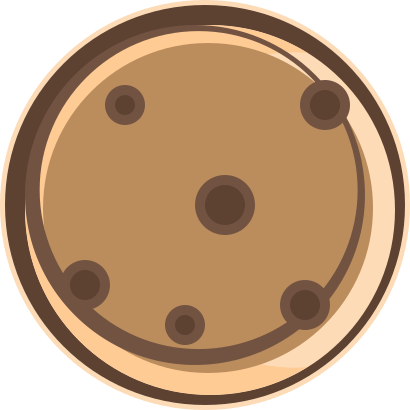
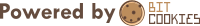

 
 <h2 align="center">Bitcookies</h2>

  
  
  
  
  
  

*Bit Cookies* is my development brand, used to share some desktop software and plug-ins I developed for everyone to download and use.

+ 🖥 You can view and download at [repo](https://github.com/bitcookies?tab=repositories) or [bitcookies.nousbuild.com](https://bitcookies.nousbuild.com).

+ 🎨 For more information, you can focus on my GitHub  [@windmill0503](https://github.com/windmill0503).

#### 📋 Recent Dev Projects

| Project Name                                 | Category  |
| :----------------------------------------------------------- | ------------------------- |
| [Pudding Illustration](https://github.com/windmill0503/pudding-illustration) | Illustration              |
| [Frosted Glass Theme](https://github.com/bitcookies/frosted-glass-winrar-theme) | WinRAR Theme              |
| [Pudding VSCode Theme](https://github.com/bitcookies/pudding-vscode-theme) | VSCode Theme              |
| [WinRAR Keygen](https://github.com/bitcookies/winrar-keygen) | C++                       |
| [CatTalk](https://github.nousbuild.com/get-cityweather/)     | Mini Program              |
| [City Weather](https://github.nousbuild.com/get-cityweather/) | Mini Program              |
| [Pitch Perfect](https://github.com/windmill0503/pitchPerfect) | Swift                     |

